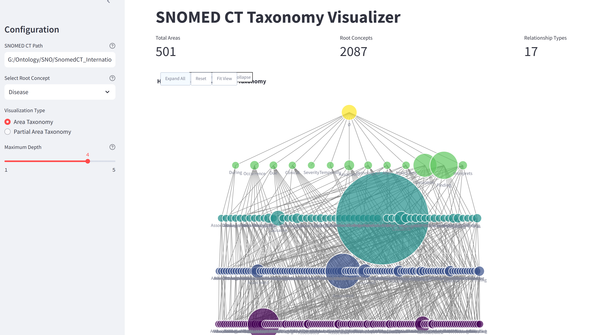
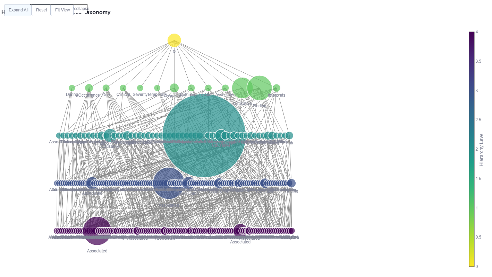

# PyOntology (in progress)

The goal of this project is to provide a Python implementation of Ontology Abstraction Framework (OAF). Converting OAF to a Python version offers a multitude of benefits, each contributing to a more efficient and adaptable software development process:

- Readability and Maintainability: Python's clean syntax and readability make the code more accessible, fostering collaboration and easing onboarding for new developers.

- Extensive Standard Library and Ecosystem: Python's vast standard library and third-party packages provide a wealth of tools, reducing development time and effort.

- Versatility in Programming Paradigms: Python supports various programming paradigms, enabling a smooth transition and integration of diverse components within the codebase.

- Web Development Opportunities: Python's robust web frameworks, such as Django and Flask, facilitate easy web deployment, transforming a standalone Java application into a dynamic web-based service.

- Data Science and Machine Learning Capabilities: Python's dominance in data science and machine learning allows for seamless integration with popular libraries like TensorFlow and scikit-learn, opening avenues for intelligent features within the application.

- Graphical User Interface (GUI) Development: Python's support for GUI frameworks like Tkinter and PyQt enables the creation of user-friendly interfaces, enhancing the overall user experience.

- Scalability and Adaptability: The transition to Python positions the software for future scalability and adaptability, aligning it with evolving technological trends.

- Community Support: Python boasts a large and active community, providing ample resources, documentation, and community-driven support for developers.

- Cost-Efficiency: Python's efficiency in development and its open-source nature contribute to cost savings in terms of time and resources.

- User-Centric Experience: With improved web deployment and GUI capabilities, the conversion enhances the potential for a more engaging and user-friendly experience

## What is Ontology Abstraction Framework (OAF)?
The Ontology Abstraction Framework (OAF) is a free and open-source software system for visually summarizing the structures of ontologies. The OAF enables users to create and explore structural summaries of ontologies called abstraction networks. The OAF is being developed as part of an ongoing research project at the Structural Analysis of Biomedical Ontologies Center (SABOC) in the Computer Science Department at the New Jersey Insitute of Technology. The OAF is playing a key role in SABOC's research into the structure of biomedical ontologies (specifically, the ontologies found in the NCBO BioPortal).
The OAF supports ontologies in Web Ontology Language (OWL)and Open Biomedical Ontologies (OBO) format. The OAF has two major components: a system for creating, visualizing, and exploring abstraction networks and a hybrid text-diagram concept browser for reviewing the modeling of individual ontology concepts. The theoretical foundations of the OAF are described in:

Ochs C, Geller J, Perl Y, Musen MA.
A unified software framework for deriving, visualizing, and exploring abstraction networks for ontologies.
Journal of Biomedical Informatics. 2016 Aug 31;62:90-105.
The OAF Protege Plugin and OAF for OWL/OBO utilize the OWL API and Protege API.

1.1. Types of Abstraction Networks Supported by the OAF
The OAF supports the following kinds of abstraction networks:
Partial-area Taxonomies: Summarize subhierarchies of concepts that are modeled with the same types of defining relationships (e.g., properties in OWL, relationships in OBO, and attribute relationships in SNOMED CT). Concepts are separated into disjoint sets called areas, which contain of concepts with the exact same set of defining relationships. Areas are separated into partial-areas, which summarize subhierarchies of semantically similar concepts in each area.
Disjoint Partial-area Taxonomies: When an ontology allows concepts to have multiple parents a given concept may be summarized by multiple partial-areas, according to which subhierarchies it belongs to. A disjoint partial-area taxonomy separates concepts into disjoint sets called disjoint partial-areas, which visually identify points of intersection between partial-areas.
Tribal Abstraction Network (TAN): Summarize the intersections between user-selected subhierarchies in an ontology. Concepts are partitioned into disjoint sets called bands, which identify the subhierarchy/subhierarchies a set of concepts belongs to. Bands are partitioned into clusters, which identify subhierarchies of concepts that exist at a specific point of intersection between two or more subhierarchies.
Disjoint Tribal Abstraction Networks: As with partial-areas, a given concept may be summarized by multiple clusters. A Disjoint TAN separates concepts into disjoint units called disjoint clusters, which summarize the points of intersection between clusters in a band.
Target Abstraction Network (Target AbN): Also called Range AbN (when applied to OWL/OBO ontologies) or Ingredient AbN (when applied to NDF-RT). Summarizes subhierarchies of concepts that serve as targets for defining relationships, along with the source concepts that have relationships pointing to the target concepts.

1.2. Live Abstraction Networks
A Live Abstraction Network is an abstraction network that updates as an ontology is edited. The Protege Plugin version of the OAF includes in-development functionality for live abstraction networks. As you edit your ontology, the summary provided by the abstraction network will accurately reflect the current state of your ontology. We have tested live abstraction network functionality with each of the above abstraction network types.
Live abstraction networks in the OAF Protege Plugin also include the ability to switch back and forth between abstraction networks created from the asserted relationships of an ontology and the inferred relationships of an ontology.

1.3. Live Diff Partial-area Taxonomies
The OAF Protege Plugin includes initial support for Live Diff Partial-area Taxonomies, which summarize changes to your ontology as you are editing it. Live diff partial-area taxonomies can be derived from a fixed version of the ontology or progressively as each edit is applied. Additionally, live diff partial-area taxonomies can be derived using asserted relationships or inferred relationships, and changes can be tracked across both.
